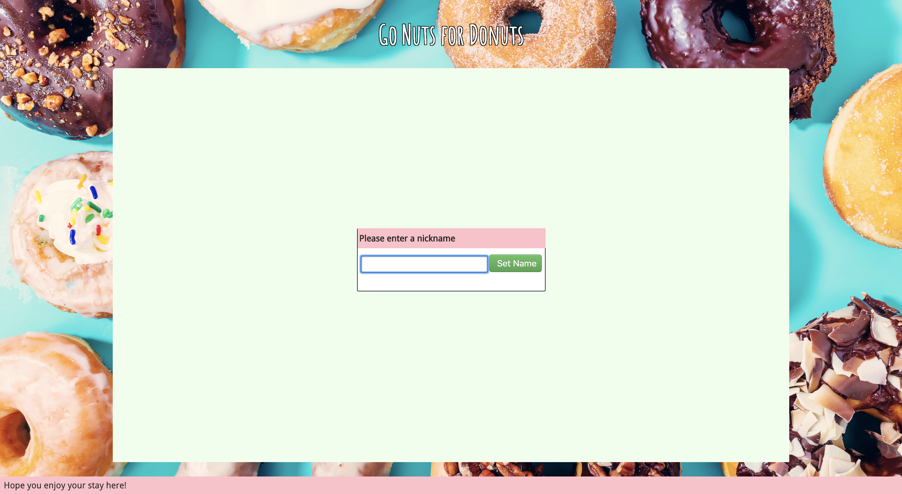
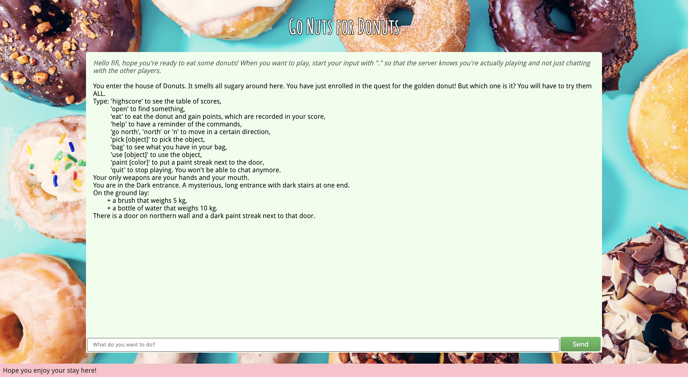
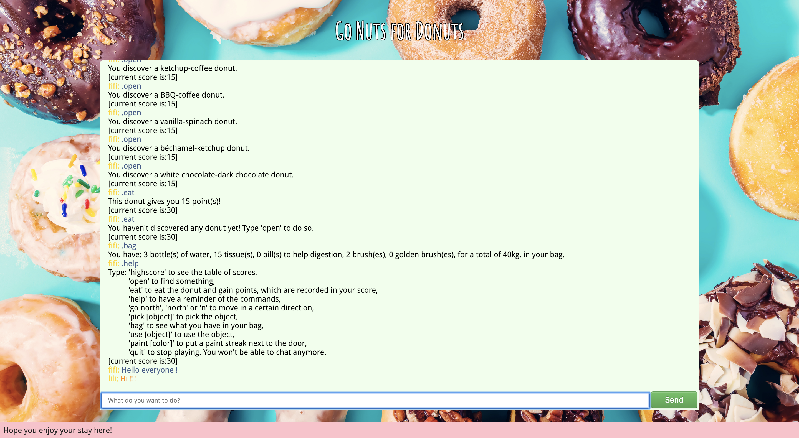

# Donuts Game: Go Nuts for Donuts!
> A simple multiplayer text-based adventure game where you have to find the golden donut.

<p align="center"></p>
<p align="center">
<p align="center"></p>

## To run the game:
```shell
      $ cd donutsgame/
      $ npm install
      $ npm start
```
Then connect to [localhost:3000](http://localhost:3000/) and enjoy!

(One time play. When you quit, you lose your bag and your counter.)
